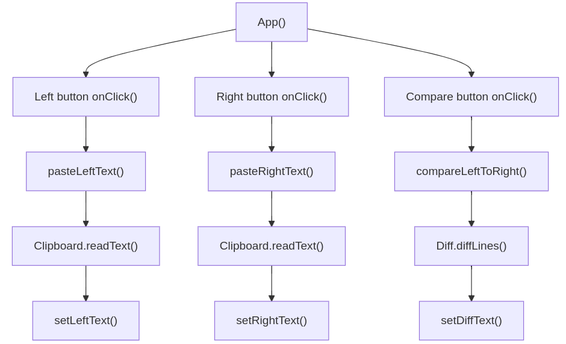

# Differ - A Simple Text Comparison Tool

A single-page React application (SPA) for comparing text buffers directly in a browser. The application operates in two modes:

- **Character Comparison**: for a single line of text.
- **Line Comparison**: for multi-line text.

Unlike other desktop tools, there is no need to save text to a file before comparing. Simply paste the text into the text areas and click the compare button.

## Model-View-Controller

### View

The custom React component *Panel* is a composition of standard HTML *button* and *div* elements. The custom component is rendered (instantiated) three times to create the left, right, and compare views.

### Controller

The role of the controller (callback functions) is to customize the behavior of the views, even though they are instances of the same *Panel* component.

### Model

The application data (content of all three text areas) is stored in React state variables. The state is updated by the controller functions, triggering re-rendering of the views.

## Visualization

The *Chart* component is a simple instance of the AG-Charts library's bar chart. The chart visualizes lines or characters added (green) or removed (red).

